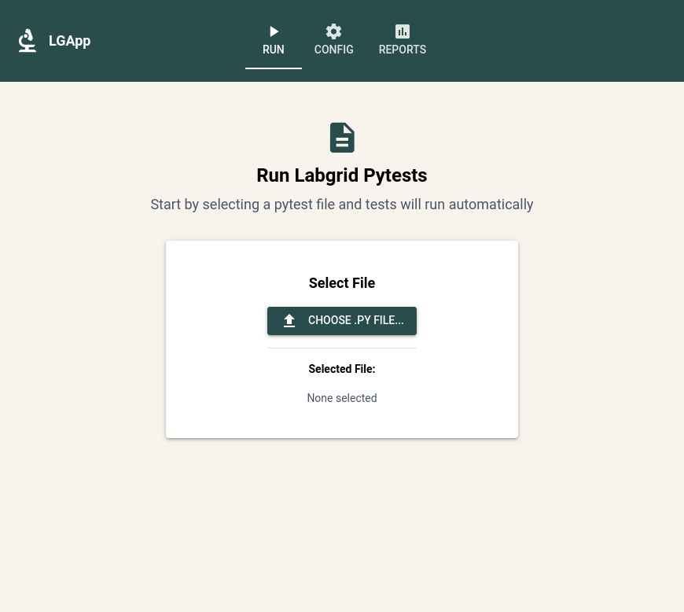
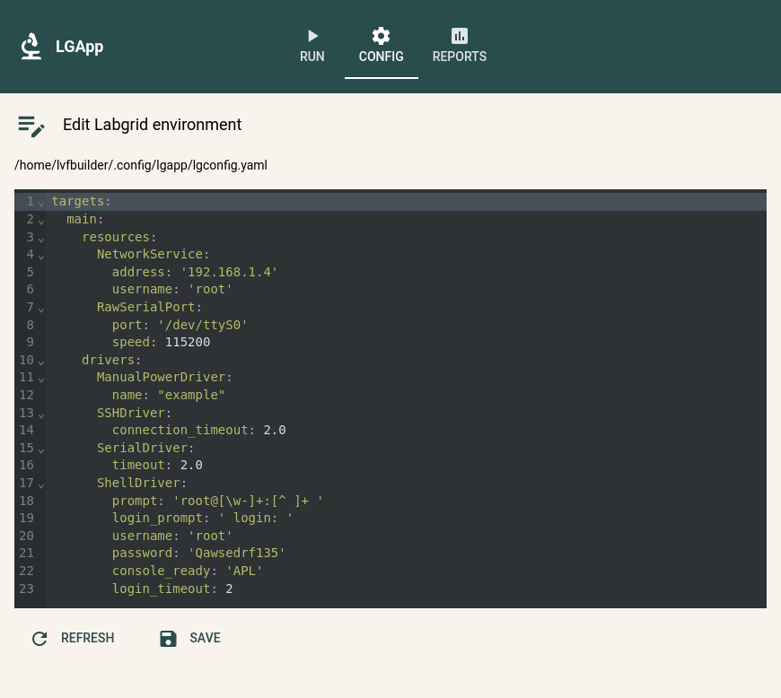
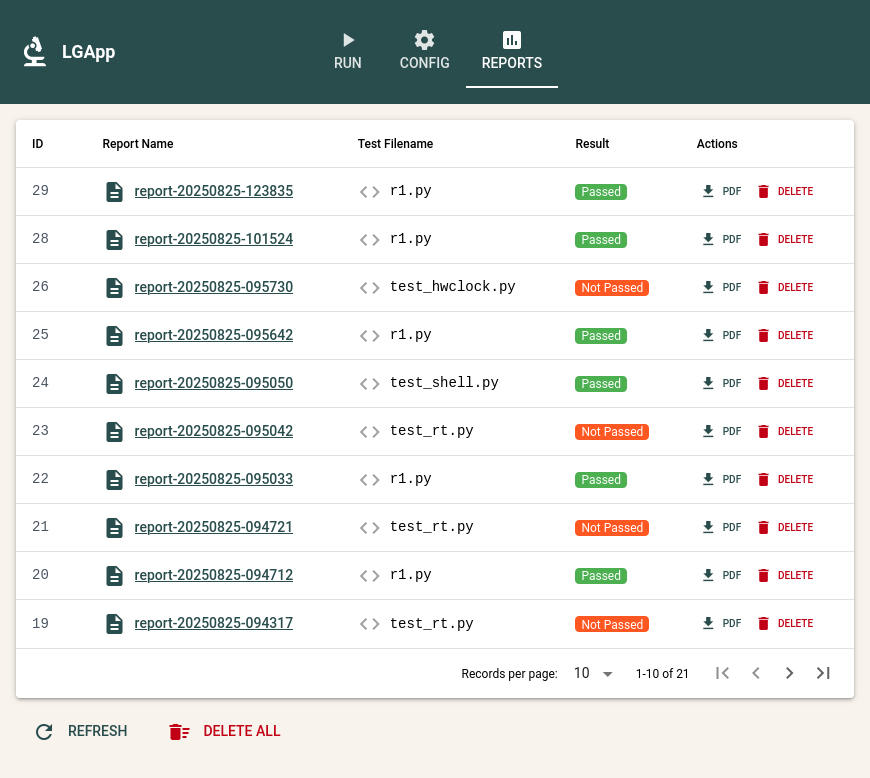

# 🚀 LGApp

**LGApp** is a lightweight web application that integrates with [Labgrid](https://labgrid.readthedocs.io/en/latest/) via its `pytest` plugin, allowing you to easily pick and run tests, view results in the browser, and generate **HTML/PDF reports**.

---

## ✨ Features
- 📂 Select and run any `pytest` file with Labgrid  
- 🌐 View **interactive HTML reports** directly in your browser  
- 📑 Export and download **PDF versions** of reports  
- 🗂️ Manage previous runs (view, download, or delete reports)  

---

## 🛠️ Requirements
- **Python** 3.10+  
- **macOS/Linux** (Windows not tested yet)  
- [Labgrid](https://labgrid.readthedocs.io/) installed and configured  

---

## 📦 Installation

### Install via PyPI
```bash
pip install lgapp
```

### Install from Source
```bash
git clone https://github.com/danteppc/lgapp.git
cd lgapp
python3 -m venv .venv
source .venv/bin/activate
pip install -e .
```

---

## ▶️ Run LGApp
Once installed, launch with:
```bash
lgapp
```

Then open your browser at 👉 [http://localhost:8080](http://localhost:8080)

---

## 🖥️ Usage Guide

### **Run Tests**
- Navigate to the **Run** tab  
- Choose a `.py` test file (defaults to `~/lgtest`, but you can browse anywhere)  
- Tests run automatically, and you’ll be redirected to the generated report  

### **Manage Reports**
- Go to the **Reports** tab  
- View previous runs  
- Export to **PDF** or delete reports you no longer need  

---

## 📂 Data & Configuration

LGApp uses OS-specific user directories:

- **Reports & Database:** stored in the user’s **data dir**  
- **Labgrid environment config:** auto-generates a default `lgconfig.yaml` in the user’s **config dir** on first run  

This ensures a clean setup without cluttering your project folders.

---

## 📸 Screenshots

| Run Tests | Configure Labgrid | Manage Reports |
|-----------|------------------|----------------|
|  |  |  |

---

## 🤝 Contributing
Contributions, issues, and feature requests are welcome!  
Feel free to open an [issue](https://github.com/danteppc/lgapp/issues) or a PR.

---

## 📜 License
This project is licensed under the [MIT License](LICENSE).

---
